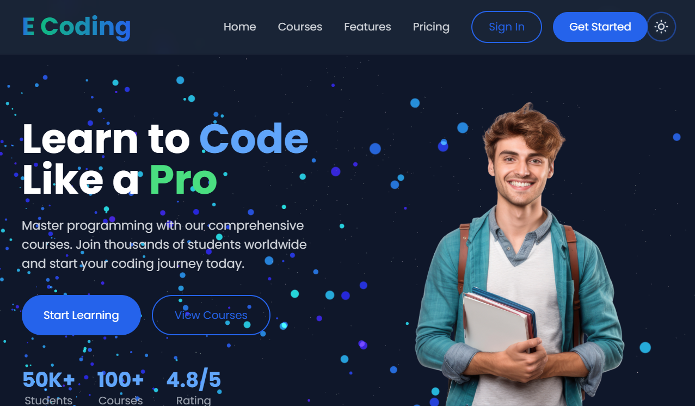

# E-Coding - Modern E-Learning Platform 🚀

  

## ✨ Live Demo

[View Live Demo](https://YOUR_USERNAME.github.io/e-learning-website/) | [View Repository](https://github.com/your-username/e-learning-website)

## 🎯 Features

### 🌓 Dynamic Theme Switching
- Seamless dark/light mode transition
- System preference detection
- Persistent theme selection

  

### 🎨 Interactive 3D Background
- Dynamic particle system
- Mouse-responsive animations
- Smooth color transitions

  

### 📱 Responsive Design
- Mobile-first approach
- Fluid layouts
- Optimized for all devices

  <table>
    <tr>
      <td></td>
      <td></td>
      <td></td>
    </tr>
  </table>

### 📚 Course Catalog
- Dynamic course cards
- Interactive hover effects
- Categorized learning paths

  

## 🛠️ Technologies Used

- 
- 
- 
- 

## ⚡ Core Features

- 🎨 Modern UI/UX Design
- 🌓 Dark/Light Theme
- 📱 Fully Responsive
- 🎬 Smooth Animations
- 🎮 Interactive Elements
- 🔍 Dynamic Course Search
- 👥 User-friendly Interface
- 🚀 Optimized Performance

## 🚀 Getting Started

1. **Clone the repository**